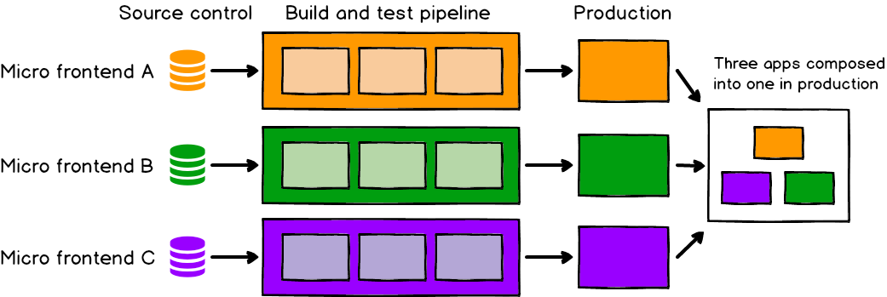

# 前端也可以搞微服務？！前端最複雜的一種架構

## (一) 原來這是微前端

### 什麼是微前端？

或許你聽過或是沒聽過以下詞彙，「微前端」、「微應用」、「前端微服務」。這些都是相同的東西，後面的文章我都會用「微前端」來稱呼。

你可能聽過微服務，這是已經行之有年的軟體開發架構風格，可以讓單一應用程式有自己的開發、部署、執行的生命週期，透過網路通道來達到相互溝通的能力。微服務是一個很好的切分單位，可以更容易讓更大的團隊溝組織通協作開發。

那什麼是微前端呢？

微前端就是把微服務的架構概念套來前端，將前端需要的模組分散在不同的服務上提供，而不是將所有資訊塞在同一個單體式架構中。所以可能在同一個前端應用程式中，有好幾個儲存庫與分出數個團隊一同開發與維護，並每個團隊都各自管理自己的部分，透過架構去組裝整個應用程式，獨立開發獨立部署。

### 微前端要解決什麼問題？

會出現一種架構，代表背後就有一個要解決的問題。通常有以下幾種問題時，都可以考量導入微前端來解決當前架構問題。

- 當單一前端專案越來越巨大，已經影響編譯時間與開發效率。
- 單一前端應用需要跨部門多個工程師共同維護，同一個產品已經很進行版本管理。
- 單一產品需要整合多種框架或多種版本共存迭代。
- 單一前端應用需要階段性部署，不要一次進行 rolling，改採針對有差異的部分 rolling deploy，提高穩定度。
- 有大量需要多專案共用的業務與介面需要外放提供時。

### 有哪些知名企業有使用微前端？

- Amazon：Amazon 在其網頁應用中使用 MicroFrontend 來管理不同的功能模塊。
- IKEA：IKEA 利用 MicroFrontend 來實現其線上購物網站的不同部分，確保各模塊的獨立性和靈活性。
- Spotify：Spotify 使用 MicroFrontend 來拆分其音樂平台的不同功能模塊，以便更快速地部署和更新。
- Zalando：這家歐洲的線上時裝零售商使用 MicroFrontend 來改進其電子商務平台。

### 我怎麼看微前端？

剛開始我接手時，其實根本沒有成功建立任何的微前端，我是從頭建制這整個架構。而建構微前端的過程也是經歷許多坡折，但既然面對了就必須做好，作為公司想要推行的一項主軸技術，我就有責任把它處理好。

後面我會把這來龍去脈和心酸血淚逐條逐項分享，讓想嘗試這架構的你可以少走點彎路，其中也包含很多就算不是實作微前端也會遇到的前端基礎建設問題，讓我們各個擊破吧！

### Resource

- [ThoughtWorks Tech Radar](https://thoughtworks.com/radar/techniques/micro-frontends)
- [Micro frontends - An architectural style where independently deliverable frontend applications are composed into a greater whole](https://microfrontends.com/)
- [Micro Frontends - extending the microservice idea to frontend development](https://micro-frontends.org/)
- [Micro Frontends in Action (實體書)](https://www.manning.com/books/micro-frontends-in-action?a_aid=mfia&a_bid=5f09fdeb)
