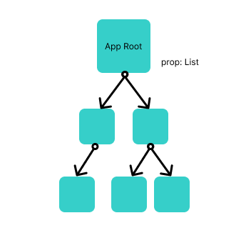
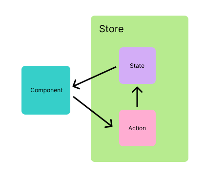
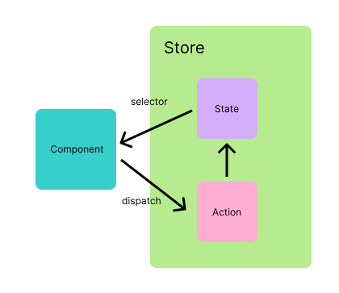
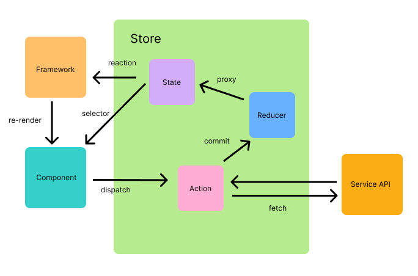

# 造一個狀態管理器的輪子

## 前言

大家好，我是造輪子的竹子，今天要來造一個狀態管理器的輪子。狀態管理器是一個很常見的東西，但是我們很少去思考它的實現原理，這篇文章就是要來探討一下狀態管理器的實現原理，並且實作一個簡單的狀態管理器。

## 狀態管理器的概念

### 狀態管理器解決了什麼問題？

狀態管理器是一個用來管理狀態的工具，它可以讓我們在任何地方都可以取得狀態，並且可以在任何地方改變狀態，這樣的好處是我們可以在任何地方都可以取得狀態，不需要一層一層的傳遞，也不需要一層一層的回傳，這樣的好處是可以讓我們的程式碼更加的簡潔。相對的也有缺點，狀態管理器的使用會讓我們的程式碼變得更加的難以理解，因為我們不知道狀態是從哪裡來的，也不知道狀態是從哪裡改變的。所以不管你用的是 React、Vue 什麼框架，一定都需要用到狀態管理器。

首先我們先來看一下狀態管理器的概念圖：

可能你有一個 Props 叫 "List"，你每一個 Component 都需要它，你得一層層往下丟，而且你的 Component 都需要宣告一個 Props 叫做 "List"。這樣的做法會讓你的程式碼變得很冗長，而且你的程式碼會變得很難以理解，因為你不知道 "List" 是從哪裡來的，也不知道 "List" 是從哪裡改變的。

改成這樣我就知道我的 state 集中於 store 之中，我要取得 state 就從 store 之中取得，我要改變 state 就從 store 之中改變，這樣的好處是我不需要一層一層的傳遞，也很清楚是誰提供了這個狀態。

> 常常在大家專案看到的 `store` 並不是指 `商店`，其實是指 `storage` 這個詞彙，雖然源頭已經不是這麼重要的事情，但是我們還是要知道它的來源，這樣才能更加的了解它的概念。

### 狀態的取得與改變

我們基於上面的基本概念之後，可以知道 Store 能獨立於 Component 之外，並且能夠提供狀態給 Component。但是如果直接獲取狀態直接改動狀態，這樣的做法會讓我們的程式碼變得很難以追查副作用，因為我們不知道狀態是從哪裡來的，也不知道狀態是從哪裡改變的。所以我們需要一個方法來取得狀態，也需要一個方法來改變狀態。

這樣架構上就多了一個叫 Action 的地方，用來與 State 做溝通，並且避免在 Component 直接改變 State，這樣的好處是我們可以很清楚的知道狀態是從哪裡來的，也很清楚的知道狀態是從哪裡改變的。所以要取得狀態資訊會操作 selector，篩出元件真正需要用到的狀態，要改變狀態會操作 dispatch 來通知 Action 去修改狀態。

> 這樣的主軸架構幾乎主流狀態管理器都具備，只是使用的名稱略有不同而已。

### 狀態管理器的架構

但這只是一個粗暴的架構，沒辦法完整說明主流的狀態管理器全部的實作細節，所以我們需要一個更加完整的架構來說明主流的狀態管理器全部的實作細節。

基於圖，可以發現多了 Framework 這個地方，這裡表述的是前端框架。所以加上 reaction 的機制去跟框架進行綁定，這樣才能更精準的知道什麼時候該進行更新。當然在不同的狀態管理器很可能實作不同的應用邏輯，也會更細微去調整對於狀態的監測與切分方法。

然後是定義了一個叫 Reducer 的地方，這裡表述的是行為對於狀態的操作者與協調者，他身為仲介者去管理對狀態的操作。因為 Action 很可能會有對於服務的請求，而對於外部服務的請求也會是一個非同步的行為，這樣在攔截與操作會非常不好去確認狀態更新的切確時間點，所以這一層 Reducer 是一個同步的處理。而操作的狀態會經過一層 Proxy，這操作的對象狀態不會是原以為預期當初的那一個物件對象，而是一個 Proxy 物件，這樣的好處是可以在操作狀態的時候，可以進行操作攔截，而如此就可以很好的去設計對於狀態的監測機制。

## 狀態管理器面臨的挑戰

首先就是資源共享，因為狀態管理器是一個全域的資源，所以很容易會有資源衝突的問題，所以我們需要一個機制去確保資源的唯一性，這樣才能避免資源衝突的問題。也要小心多實體情況能正確判讀，不會因為多實體去請求共用同一個記憶體對象造成對象判讀上的失誤。

然後就是狀態的更新與監測，我們需要一個機制去確保狀態的監測是精準的，並知道更新與同步的時間點，也能確保監測的對象是唯一。不會因為值的改變而造成監測的對象不一致，也不會因為監測的對象值的相同而分不清楚隸屬的記憶體對象錯亂。

再來是必要的監測與反應。所以要正確相互比對確認真的發生`狀態改變`再來觸發 reaction，不應該無差別因為操作了 Action 去而引起不必要的更新事件。

理論說完了，接下來就是實作的部分了......