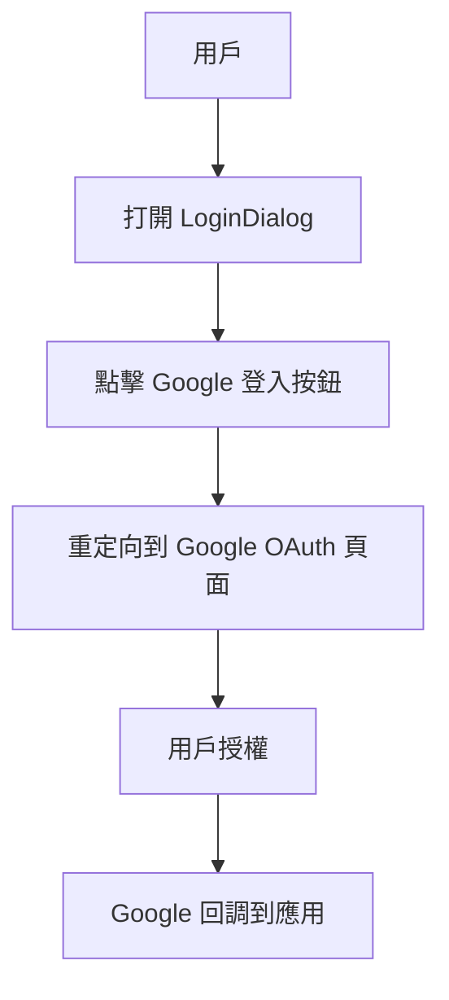
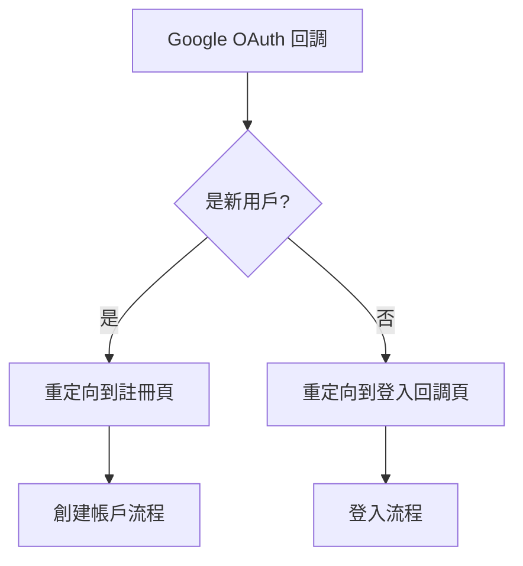
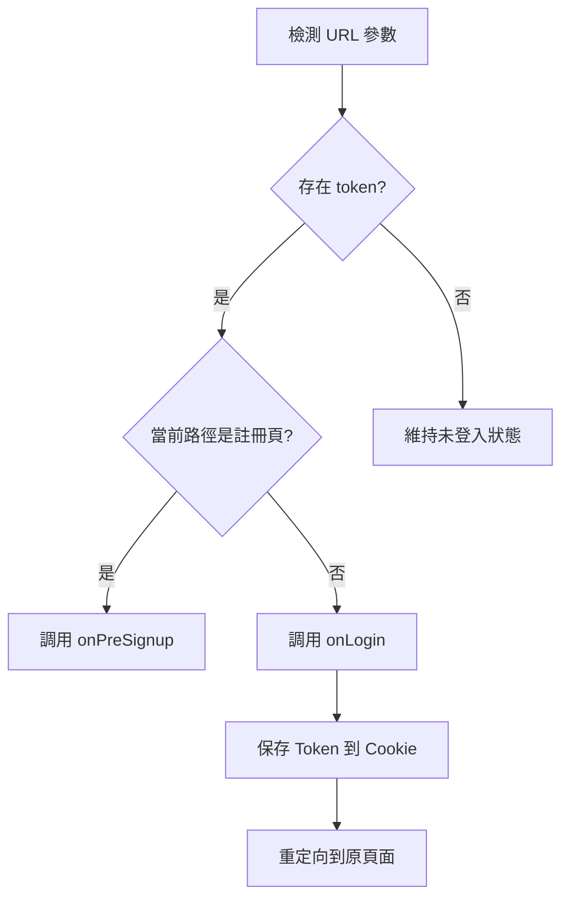
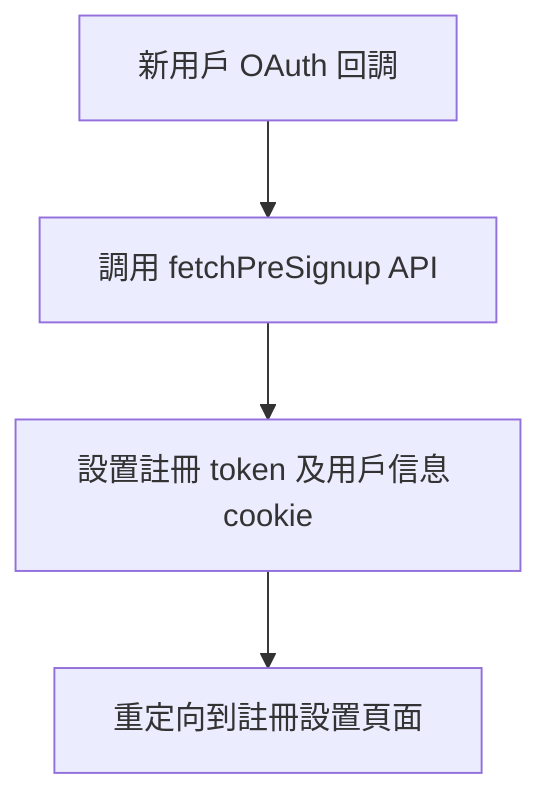
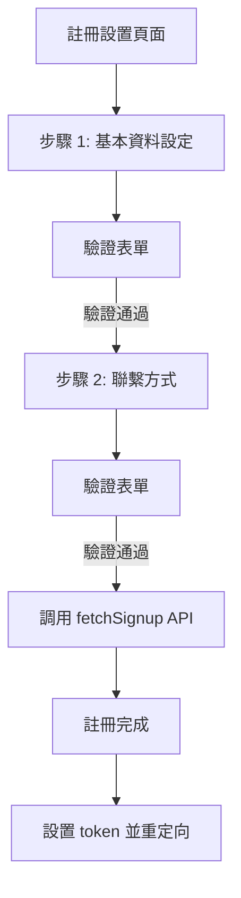
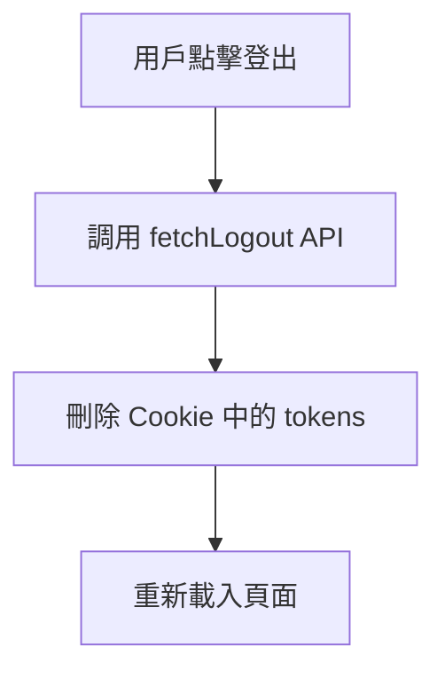
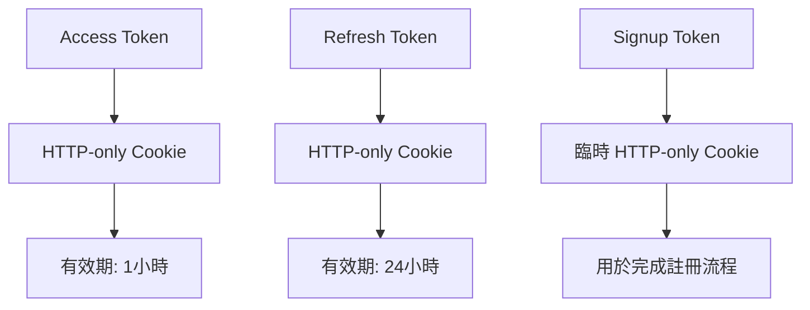

# 登入註冊機制分析

根據提供的代碼，我將為您分析並說明這個應用的登入註冊機制。這個系統主要使用 Google OAuth 進行身份驗證，並有完整的登入、註冊和登出流程。

## 登入流程

### 1. 登入入口

用戶通過 `LoginDialog` 組件開始登入流程，點擊 "使用 Google 登入" 按鈕。

### 2. OAuth 回調處理

當 Google 認證完成後，系統會獲取 access token 和 refresh token。

### 3. 登入流程處理

`AuthProvider` 組件檢測 URL 參數中的 token，並調用相應的 API：

## 註冊流程

### 1. 預註冊處理

新用戶被重定向到註冊頁面，系統會調用 `fetchPreSignup` API 來保存初始信息：

### 2. 完成註冊過程

在 `LoginSetting` 組件中，用戶需完成分兩步的註冊表單：

## 登出流程

用戶登出時，系統調用 `fetchLogout` API：

## API 端點

系統使用以下 API 端點處理身份驗證：

1. `/api/auth/login` - 設置 access_token 和 refresh_token cookie
2. `/api/auth/logout` - 刪除身份驗證 cookies
3. `/api/auth/presinup` - 設置註冊相關的臨時 cookies
4. `/api/auth/sinup` - 完成註冊流程

## Token 處理

系統使用 HTTP-only cookies 來安全地存儲 tokens：

## 用戶認證狀態

`AuthProvider` 和 `TokenProvider` 組件共同負責管理用戶的認證狀態：

1. `TokenProvider` 從 cookies 中讀取 token 並提供給應用
2. `AuthProvider` 提供 `isLogin` 狀態和 `fetchLogout` 方法給整個應用使用

## 安全考慮

1. 使用 HTTP-only cookies 防止 JavaScript 訪問 tokens
2. 在非開發環境中使用 secure cookies 確保只通過 HTTPS 傳輸
3. Token 設有合理的過期時間
4. 使用 OAuth 避免直接處理用戶密碼

這種登入註冊機制通過 Google OAuth 提供了一種安全且用戶友好的身份驗證方式，同時提供了完整的用戶註冊體驗。
