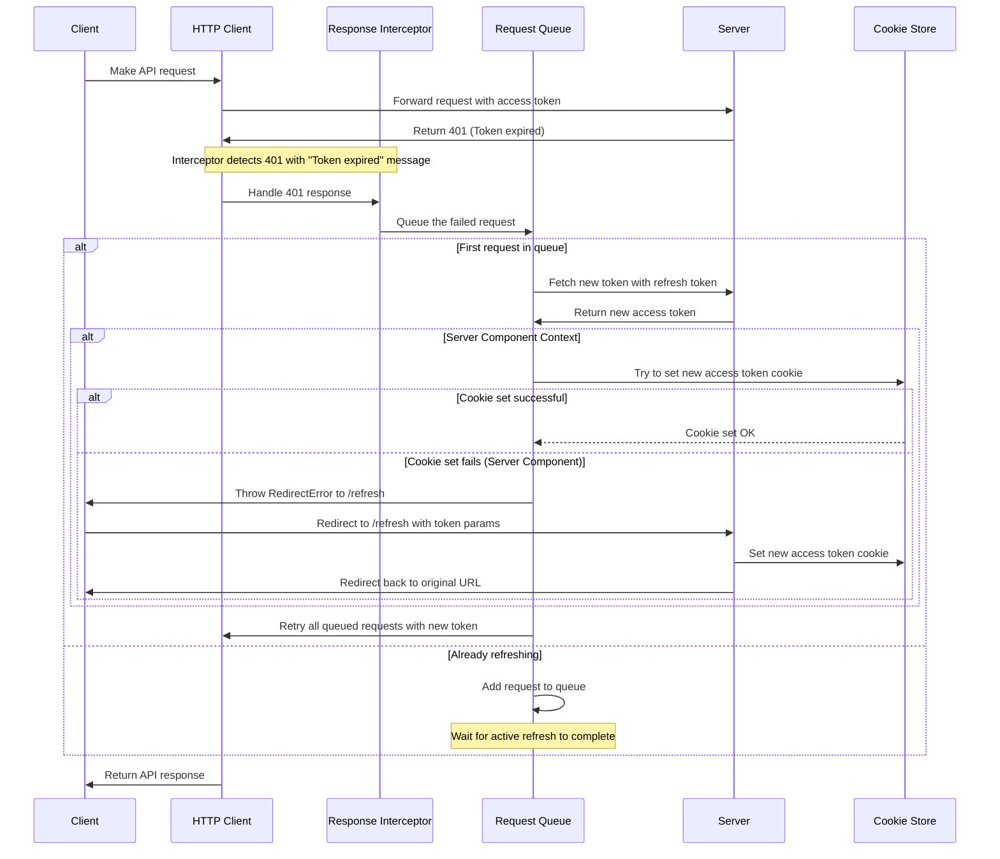

# Refresh Token Mechanism

## Overview

Refresh Token 機制提供了一種安全的方式來維護使用者會話，而無需頻繁登入。當使用者的存取 Token 過期時，系統會使用長效 Refresh Token 自動更新它，從而允許持續存取受保護的資源，同時保持安全性。

## Components

Refresh Token 實作由幾個關鍵元件組成：

1. **HTTP Client** (`http/client.ts`) - 帶有攔截器的核心 HTTP 用戶端
2. **Refresh Token Plugin** (`http/interceptors.ts`) - 處理 Token 過期和刷新
3. **Request Queue Factory** (`http/refreshToken.ts`) - 管理並發刷新請求
4. **API** (`services/auth/index.ts`) - 包含刷新Token API 呼叫
5. **Next API Server** (`app/api/refresh/route.ts`) - 處理 RSC Refresh Token

## Flow Chart



## 詳細流程

### 1. 正常請求流程

1. Any Client (不限於 Browser or Server) 透過 HTTP 用戶端發出 API 請求
2. HTTP 用戶端將 Cookie 中的存取 Token 加入 Request Headers 中
3. 請求發送到 Backend API Server
4. 如果存取 Token 有效，伺服器將正常處理請求

### 2. Token 過期流程

當訪問 Token 過期時：

1. 伺服器傳回 401 狀態代碼，並顯示「Token expired」訊息
2. 響應攔截器捕捉401錯誤
3. 系統檢查 cookie 中是否有刷新Token
4. 如果可用，則開始刷新Token過程

### 3. Token 刷新流程

Refresh Token 過程由 `requestQueueFactory` 管理，它：

1. 將因 Token 過期而失敗的所有請求放入佇列
2. 確保只發出一個刷新 Token 請求，即使多個 API 呼叫同時失敗
3. 使用刷新 Token 取得新的存取 Token
4. 更新 cookies 中的存取 Token
5. 使用新 Token 重試所有排隊的請求

### 4. RSC 處理

由於 Next.js RSC 無法直接修改 Cookie：

1. 如果系統偵測到它處於 RSC 上下文中（cookie 設定失敗）
2. 它會拋出 `RedirectError`
3. 在完成 axios 的 interceptors，會依照 `RedirectError` 導向到 `/refresh`
4. 頁面重新請求 `/api/auth/refresh` 來 設定 cookies 寫入新的 token
5. 如果成功，使用者被重新導向回原始頁面
6. 使用新 Token 重試請求

### 5. 錯誤處理

系統包含幾種錯誤處理機制：

1. 重試限制 - 防止無限刷新循環，預設是 3 次
2. 伺服器元件重定向 - 處理 cookie 限制
3. Queue 管理 - 確保有序處理並發請求

## Key Implementation Details

### HTTP Client Setup

```typescript
// From client.ts
export function http(options: CreateHttpOptions = {}): HttpClient {
  const plugins: ((instance: AxiosInstance) => void)[] = []
  // ... other plugins
  plugins.push(refreshTokenPlugin())
  // ...
}
```

### Refresh Token Plugin

```typescript
// From interceptors.ts
export function refreshTokenPlugin() {
  return (instance: AxiosInstance) => {
    instance.interceptors.response.use(null, async (error) => {
      // ... handle 401 errors
      if (error.response?.status === 401 && error.response.data?.message === 'Token expired' && refreshToken) {
        try {
          return await executeRefreshToken(refreshToken, { error, instance })
        } catch ($error) {
          if ($error instanceof ServerComponentCookieError) {
            // Handle Server Component redirection
          }
        }
      }
      // ...
    })
  }
}
```

### Request Queue Factory

```typescript
// From refreshToken.ts
export function requestQueueFactory<Key, Context, Req, Res>(
  createContext: (req: Req, resolve: (res: Res) => void, reject: (error: unknown) => void) => Context,
  resolveQueue: (queue: Context[]) => Promise<void>,
): (key: Key, request: Req) => Promise<Res> {
  // ... manages concurrent refresh requests
}
```

## Security Considerations

1. **HttpOnly Cookies** - 存取和 Refresh Token 儲存在 HttpOnly cookies 中，以防止 XSS 攻擊
2. **安全標誌** - 在生產環境中，cookie 會設定安全標誌，以確保僅透過 HTTPS 進行傳輸
3. **有限的令牌生命週期** - 訪問令牌的生命週期較短（暫定 1hr）
4. **重試限制** - 系統透過重試計數防止無限刷新循環

## API Reference

### fetchRefreshToken

```typescript
// From refreshToken.ts
export const fetchRefreshToken = async ({ 
  accessToken, 
  refreshToken 
}: RefreshTokenRequestDTO): Promise<RefreshTokenResponseDTO> => {
  // ... performs token refresh API call
}
```

### POST /api/auth/refresh

```typescript
// From route.ts
export async function POST(request: NextRequest) {
  // ... handles refresh token endpoint
}
```

## Common Issues and Troubleshooting

1. **Cookie 設定失敗** - RSC 無法直接設定 Cookie，導致重定向
2. **Refresh Token 缺失** - 如果沒有可用的 `refreshToken`，身份驗證將失敗
3. **伺服器端 vs 客戶端** - 在伺服器端和客戶端執行時的不同行為

## Best Practices

1. 始終檢查 Token 過期錯誤（帶有特定訊息的 401）
2. 使用重定向機制處理 RSC 限制
3. 實施重試限制以防止無限循環
4. 使用安全的 HttpOnly cookie 來儲存 Token
