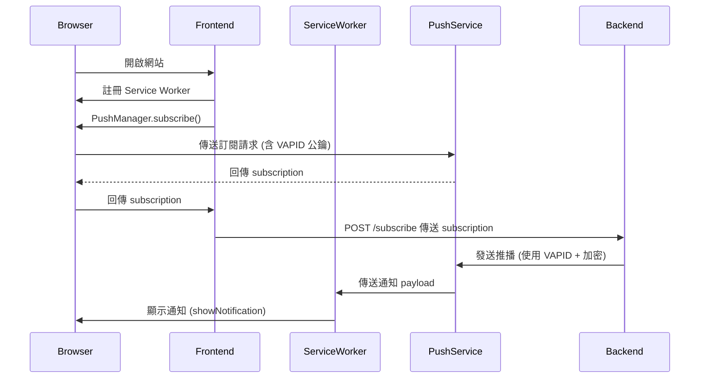

# 📬 Web Push

## 🌐 Web Push 是什麼？

Web Push 是一種機制，允許網站在使用者**關閉瀏覽器或網頁時**仍能透過**通知欄（Notification）推送訊息**給使用者。

這項功能通常結合 **PWA (Progressive Web App)** 技術，並透過 **Service Worker** 在背景接收通知。

---

## 🧠 核心概念

| 名稱 | 說明 |
|------|------|
| **Service Worker** | 背景執行程式，負責接收通知並顯示 |
| **Push Subscription** | 瀏覽器向 Push Server 登記後的資訊（包含 endpoint 與金鑰） |
| **Push Service (由瀏覽器提供)** | 如 FCM、Mozilla Push，負責中繼通知 |
| **Application Server (你自己寫的後端)** | 你伺服器端，負責發送通知 |
| **VAPID** | 一種身份驗證方式，讓推播請求合法化 |

---

## 🔄 Web Push 完整流程



---

## 📦 Subscription 內容範例

```json
{
  "endpoint": "https://fcm.googleapis.com/fcm/send/abcdef...",
  "expirationTime": null,
  "keys": {
    "p256dh": "BOPxv....",
    "auth": "abc123..."
  }
}
```

---

## 🔐 VAPID 金鑰產生與使用

產生 VAPID 金鑰（僅需一次）：

```bash
npx web-push generate-vapid-keys
```

用在伺服器端設定：

```js
const webpush = require('web-push');

webpush.setVapidDetails(
  'mailto:you@example.com',
  'YOUR_PUBLIC_KEY',
  'YOUR_PRIVATE_KEY'
);
```

---

## 📥 Service Worker 接收推播

```js
// public/service-worker.js
self.addEventListener('push', event => {
  const data = event.data?.json() || {};
  self.registration.showNotification(data.title || '通知', {
    body: data.body,
    icon: '/icon.png'
  });
});
```

---

## 🔔 推播條件限制

| 條件 | 是否必須 |
|------|----------|
| HTTPS 網站 | ✅（或 localhost 測試） |
| 註冊 Service Worker | ✅ |
| 使用者同意授權通知 | ✅ |
| 使用 PushManager.subscribe | ✅ |
| 後端使用 VAPID | ✅（推播必需） |

---

## Service Worker Example

打包可以應用 workbox 來處理 ServiceWorker 的 JS。

```js
const { InjectManifest } = require('workbox-webpack-plugin');

const webpackConfig = {
  plugins: [
    new InjectManifest({
      swSrc: path.resolve(process.cwd(), 'src', 'web-push.js'), // 輸入檔案名稱
      swDest: 'web-push.js', // 輸出檔案名稱
    })
  ]
}
```

再進行 Runtime 引入。

```js
window.navigator.serviceWorker.register('/web-push.js', { scope: 'web-push' })
```

Service Worker 內部相關實作。

```js
import { precacheAndRoute } from 'workbox-precaching';

precacheAndRoute(self.__WB_MANIFEST);

self.addEventListener('push', (event) => {
  const data = event.data.json();
  self.registration.showNotification(data.title, {
    body: data.body,
    icon: data.icon || undefined,
  });
})
```

---

## 🧪 要注意的事項

1. Service Work 的 Scope 只能是唯一的，該功能註冊時，要手動追加設定 scope 來獨立註冊。
2. 該需求需要非對稱加密解密，需要由後端建立相關 API，提供公鑰寫在前端提供驗證。
3. 如果不需要「關閉網站也能推播」的功能則無須啟動 Service Worker 和推送金鑰。
4. 使用者有最高權限可以控制是否收到該推播。
5. 一定要加上 `self.__WB_MANIFEST` 去處理 cache，否則會跳出 html 或相關 asset 找不到等等錯誤。
6. Service Worker 有快取的問題，可以搭配打包時加上 Hash 或設定 解決差異辨識。

## Webpack Setting

運用 `workbox-webpack-plugin` ，可以做到與 Service Worker 的生態系打包與設定。但基本上屬於完全另一個應用程式，跟專案是脫鉤處理的，所以要妥善控制運用相關的套件功能，以防過度肥大或記憶體開銷過大。

因為 `workbox-webpack-plugin` 並不支援檔案名稱 `[hash]` 的寫法，如果遇上快取問題需要加上 Hash，可以手動加上，編譯後用 `webpack-assets-manifest` 或 `html-webpack-plugin` 取得檔案名稱。

```js
const path = require('path');
const { InjectManifest } = require('workbox-webpack-plugin');

module.exports = {
  mode: 'production',
  entry: './src/index.js',
  output: {
    filename: 'bundle.js',
    path: path.resolve(__dirname, 'dist'),
    clean: true,
  },
  plugins: [
    new InjectManifest({
      swSrc: './src/sw.js',       // 你自己寫的 SW 原始檔案
      swDest: 'sw.js',            // 編譯後輸出的檔案
    }),
  ],
  module: {
    rules: [
      {
        test: /\.js$/,
        exclude: /node_modules/,
        use: 'babel-loader',     // 如果你用 Babel
      }
    ]
  }
};
```

### Error Case: no such file or directory, open '/{project}/dist/index.html'

這是因為編譯過程中發生問題，導致 html 輸出失敗。根本問題並不是 html 輸出的路徑或輸出的邏輯出了問題，單純是 `workbox` 輸出失敗而產生的 Flow，進而引發後面的編譯動作骨牌式失敗。

### Error Case: Can't find self.__WB_MANIFEST in your SW source

如果只是想寫基本版的 Service Worker 就會遇到的問題，

很不直覺的，`workbox` 預設採取了這個判斷，可以由 injectionPoint 進行控制，內部使用正規表達式掃描了檔案內容，作為快取的轉換點。
如果你不需要快取，可以用以下進行忽略保留，也可以避免錯誤。

```js
// eslint-disable-next-line no-unused-vars
const _doNotUseThis = self.__WB_MANIFEST;
```

## Service Worker 的更新機制

ServiceWorker 是跨越瀏覽器應用的，具備更長的生命週期。所以註冊當下並不一定會立即啟動，甚至會等到該 Web Application 完全停止才進行更新，甚至有快取的機制。如果要破壞這個生命週期都需要手動控制，不然一律不會立即生效。常用的方法有 `self.skipWaiting()` 來強迫立即生效，搭配 filename + hash 來破壞快取。
